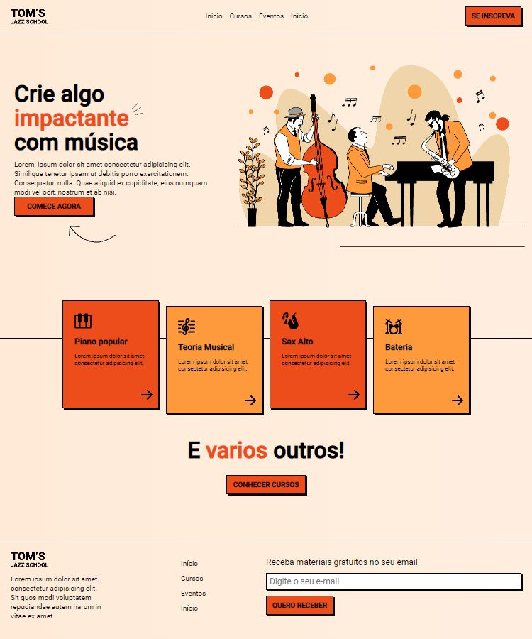

<h1 align="center"> Landing Page </h1>

Landing Page desenvolvida através de um tutorial no youtube para estudar HTML e CSS em sites WEB.  

  <a href="#-tecnologias">Tecnologias</a>&nbsp;&nbsp;&nbsp;|&nbsp;&nbsp;&nbsp;
  <a href="#-projeto">Projeto</a>&nbsp;&nbsp;&nbsp;|&nbsp;&nbsp;&nbsp;
  <a href="#-layout">Layout</a>&nbsp;&nbsp;&nbsp;|&nbsp;&nbsp;&nbsp;
  <a href="#memo-licença">Licença</a>

  

 

<h1 align="center">Mobile</h1>
  
<h1 align="center">Desktop</h1>
  

## 🚀 Tecnologias

Esse projeto foi desenvolvido com as seguintes tecnologias:

- HTML e CSS
- Git e Github
- Figma

## 💻 Projeto

Formulario desenvolvido para HTML e CSS em sites Web.

- [Visite o projeto online](https://matheuspieta.github.io/Landing_Page_Onebitcode/)

## 🔖 Layout

Você pode visualizar o tutorial do projeto através [DESSE LINK](https://www.youtube.com/watch?v=Wo7UnH8TYbc).

## :memo: Licença

Esse projeto está sob a licença MIT.

---

Feito com ♥ by Matheus Pieta